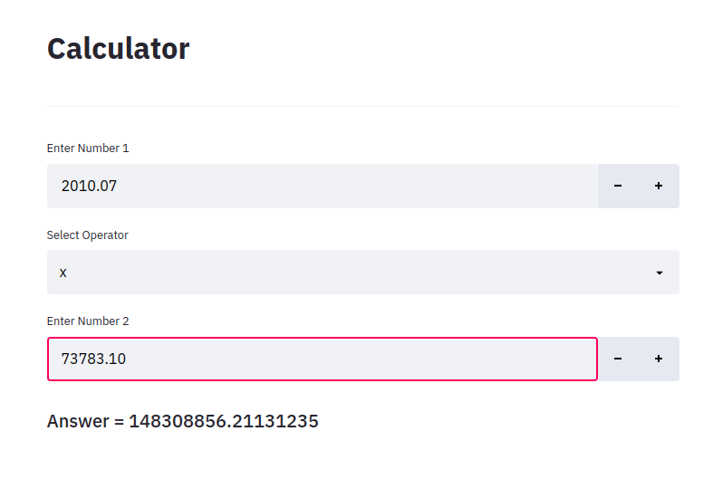

# Matlab-Python-Calculator
Python Streamlit Calculator with Matlab Backend. The main idea of the project is to understand how to merge python and matlab.

## Setup Matlab and Python

> Install Python3.6 or Python3.8 (dont forget to add the path to system variables)

> Create Virtual Environment:
>> Ubuntu / macOS
>>> $ python3 -m venv /path/to/virtualenv

>> Windows
>>> $ python -m venv /path/to/virtualenv

> Activate Virtual Environment and install dependencies:
>> Ubuntu / macOS
>>> $ source /path/to/virtualenv/bin/activate

>>> $ pip3 install -r requirements.txt

>> Windows
>>> $ /path/to/virtualenv/Scripts/activate

>>> $ pip3 install -r requirements.txt

> Open MATLAB & go to its command line & run the commands:
>> cd(matlabroot, 'extern', 'engines', 'python')

>> Ubuntu
>>> system("sudo python3 setup.py install build --build-base='/path/to/virtualenv' install --prefix='/path/to/virtualenv'")

>> Windows
>>> system("python3 setup.py install build --build-base='/path/to/virtualenv' install --prefix='/path/to/virtualenv'")

> Open project directory in python IDE (PyCharm preferable)
>> Set the virtual environment for the project from settings -> Project:ProjectName -> Python Interpreter -> Select if available else add from settings symbol.
>> Now open the terminal and run the following command:
>>> $ streamlit run gui.py

>>> If Numpy error (In Windows):
>>>> go to virtual environment directory -> Lib -> site-packages -> numpy -> __init__.py

>>>> Now go to the function win_check and comment the code "a = a % 17"

>>>> Run again... Et voila

## Running The Project

> streamlit run calculator.py

## Output

## Changes That Can Be Made

> The evaluate.py file containes the function to solve the infix expression. So if you want to take infix expression as input and solve the output you can do that. But then you won't be able to use Matlab.

## To-Do

[] Make scientific Calculator
